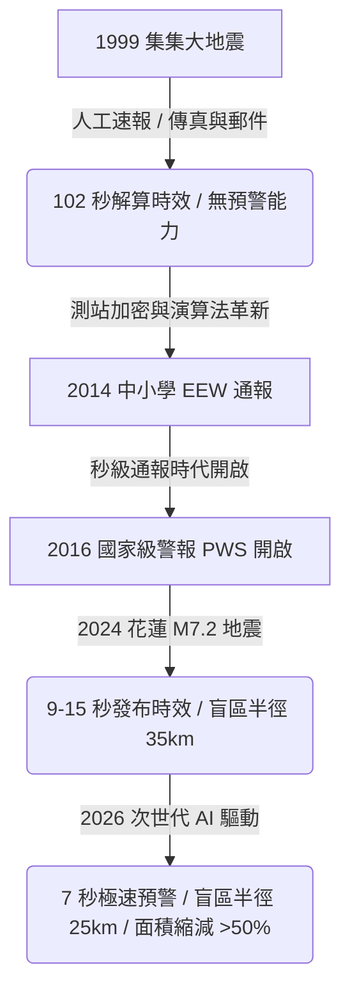
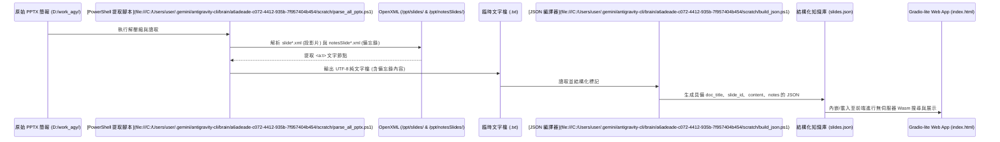

# 次世代地震測報：AI 代理群與大型語言模型整合應用專案
## Next-Generation Seismic Monitoring: AI Agent Swarm & LLM Integration Project

[](https://pages.github.com/)
[](https://opensource.org/licenses/MIT)

本專案旨在建構一個完全**免付費、低延遲、無伺服器架構 (Serverless)** 的地震預警（EEW）與 AI 代理（Agent）協作知識庫。專案核心在於整合氣象署（CWA）現行的即時監測技術，引入大型語言模型（LLM）與多代理矩陣（Agent Matrix）概念，並將非結構化的簡報知識提煉為可供學生、防災人員快速查詢的互動網頁，以 **純前端 HTML/CSS/JavaScript** 技術部署於 **GitHub Pages**。

---

## 🗺️ 專案背景與演進

臺灣處於菲律賓海板塊與歐亞大陸板塊的聚合邊界，平均每 30 至 40 年即可能發生規模大於 ML 7.0 的災害性地震。為縮短地震預警盲區（Blind Zone），中央氣象署的強震即時警報（EEW）技術在過去 30 年經歷了顯著發展：



---

## 🤖 AI 代理群協作矩陣 (Agent Matrix)

專案引進了次世代的**多代理協作系統**，透過各具專長的 Agent 建立自動化的地震事件（`.rep` 格式）監控與科研回報閉環：

| 代理角色 (Agent) | 核心技術定位 | 職責與工作流 (Responsibility) |
| :--- | :--- | :--- |
| **`my_agent`**<br>(預警總管) | 核心監控與發送端 | 維護巡檢 Cron 排程、異常日誌過濾、日報彙總、Telegram/Gmail 主動通報。 |
| **`secondary_agent`**<br>(系統整合工程師) | 跨節點調度與恢復 | 負責主機端故障恢復（`eew_fault_recovery.sh`）、Cron 配置與代理間訊息轉發。 |
| **`seismo_agent`**<br>(地震學助教) | 數據處理與自動化繪圖 | 解析原始 `.rep` 數據，產出 CSV/JSON，自動繪製震級誤差與測站延遲圖表。 |
| **`seismo`**<br>(科學研究員) | 統計建模與科研預測 | 針對小震群與深部無感地震進行建模，追蹤學術數據鏈路，提供預警閥值建議。 |

---

## 📂 知識提取與展示方案 (Knowledge Extraction Scheme)

本專案實施了**端到端非結構化簡報數據（PPTX）的提煉流程**。由於環境限制不依賴 Python 的 `python-pptx` 函式庫，而是使用 Windows 內建的 .NET `ZipArchive` 技術，並結合 XML/XPath 進行抽取：



### 📚 已提煉的簡報知識庫清單
1. **[2025-05-29 JPGU 氣象署地震監測現況與未來](file:///C:/Users/user/.gemini/antigravity-cli/brain/a6adeade-c072-4412-935b-7f957404b454/scratch/2025-0529-JPGU-new-Real-Time%20Seismic%20Data%20Processing%20and%20Monitoring%20at%20CWA%20Current%20Status%20and%20Future%20Directions.pptx.txt)**：Earthworm / SeisComP 架構、OBS 海底網路與 Grafana 數據延遲監控。
2. **[2026-05 地震預警系統效能報告](file:///C:/Users/user/.gemini/antigravity-cli/brain/a6adeade-c072-4412-935b-7f957404b454/scratch/202605_%E5%9C%B0%E9%9C%87%E9%A0%90%E8%AD%A6%E7%B3%BB%E7%B5%B1%E5%A0%B1%E5%91%8A.pptx.txt)**：分析 M6.1、M5.6 及 M5.1 地震的 PWS 發布時效（最快 9.7 秒）、誤差分析與盲區計算。
3. **[2026-06-03 AI 代理群與 LLM 整合應用](file:///C:/Users/user/.gemini/antigravity-cli/brain/a6adeade-c072-4412-935b-7f957404b454/scratch/2026_0603_AI%20%E4%BB%A3%E7%90%86%E7%BE%A4%E8%88%87%E5%A4%A7%E5%9E%8B%E8%AA%9E%E8%A8%80%E6%A8%A1%E5%9E%8B%E5%9C%A8%E6%AC%A1%E4%B8%96%E4%BB%A3%E5%9C%B0%E9%9C%87%E6%B8%AC%E5%A0%B1%E4%B9%8B%E6%95%B4%E5%90%88%E8%88%87%E6%87%89%E7%94%A8.pptx.txt)**：大型地震模型（LEM）、SeisWav2Vec 2.0 自監督預訓練、四個 Agent Matrix 的詳細會議記錄與工作流。
4. **[2026-06-12 臺灣地震預警系統的演進與發展](file:///C:/Users/user/.gemini/antigravity-cli/brain/a6adeade-c072-4412-935b-7f957404b454/scratch/2026_0612_%E5%98%89%E7%BE%A9%E7%B1%BD%E9%98%B2%E5%AE%A3%E5%B0%8E-%E8%87%BA%E7%81%A3%E5%9C%B0%E9%9C%87%E9%A0%90%E8%AD%A6%E7%B3%BB%E7%B5%B1%E7%9A%84%E6%BC%94%E9%80%B2%E8%88%87%E7%99%BC%E5%B1%95.pptx.txt)**：嘉義災防宣導、7 秒預警與 25 公里盲區的精進、深震/雙震誤報漏報探討、海嘯分區預警機制。

---

## ⚡ 網頁部署方案：GitHub Pages

我們採用 **純前端 HTML/CSS/JavaScript** 開發了一個無需任何伺服器後端的靜態互動網頁。

### 🌟 系統優勢
1. **完全免費**：部署在 GitHub Pages 上，無需負擔任何伺服器運行成本。
2. **極速加載**：無需載入 Python 直譯器，頁面秒級啟動。
3. **數據隱私**：所有搜尋與運算皆在用戶本地端（Client-side）執行，不將查詢發送至伺服器。
4. **極簡檔案結構**：[index.html](file:///D:/work_agy/gradio_lite_app/index.html) + [slides.json](file:///D:/work_agy/gradio_lite_app/slides.json) + `assets/` 圖片目錄。

---

## 🚀 部署指南 (GitHub Pages)

### 方法一：透過 GitHub Actions 自動部署（推薦）

1. **建立 GitHub 倉庫**，將本專案推送至 `main` 或 `master` 分支。
2. 啟用 GitHub Pages：
   - 進入倉庫 **Settings → Pages**。
   - 在 **Source** 選擇 **GitHub Actions**。
3. 推送後，GitHub Actions 會自動執行 `.github/workflows/deploy.yml`，將 `gradio_lite_app/` 目錄部署至 GitHub Pages。
4. 完成後可在 `https://<username>.github.io/<repo>/` 訪問。

### 方法二：手動設定

1. 進入倉庫 **Settings → Pages**。
2. **Source** 選擇 **Deploy from a branch**。
3. **Branch** 選擇 `main` / `master`，**folder** 選擇 `/gradio_lite_app`。
4. 點選 **Save**，等待數分鐘即可完成部署。

---

## 📁 專案目錄結構

```text
D:\work_agy\
│  2025-0529-JPGU-new-Real-Time Seismic Data Processing...pptx
│  202605_地震預警系統報告.pptx
│  2026_0603_AI 代理群與大型語言模型在次世代地震測報之整合與應用.pptx
│  2026_0612_嘉義災防宣導-臺灣地震預警系統的演進與發展.pptx
│  extract_pptx.ps1            # 本地自動化提取腳本 (文字與圖片提取)
│  preprocess.py               # Python 提取腳本 (雙模式解析)
│  readme.txt                  # 原始專案背景描述
│  README.md                   # 本文件 (系統架構與部署說明)
│
├─.github/workflows/
│      deploy.yml              # GitHub Pages 自動部署工作流程
│
└─gradio_lite_app/             # GitHub Pages 靜態網站根目錄
    │  index.html              # 純前端互動式網頁 (HTML/CSS/JS)
    │  slides.json             # 結構化知識庫 (164 頁投影片資料)
    │
    └─assets/                  # 提取出的簡報圖片資源目錄
            img_0001.png
            ...
```

---

## 📄 開源授權

本項目基於 MIT 授權協議開源。詳細內容請參閱內部授權規範。
氣象署 Docker 映像檔版權歸氣象署開發團隊所有。
